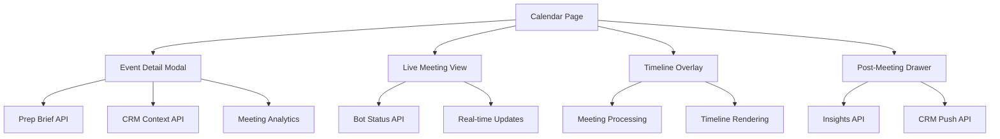

# Calendar Enhancements Implementation

## Overview

The Calendar page has been significantly enhanced with advanced AI-powered features, real-time meeting management, and enterprise-grade functionality. This implementation transforms the calendar from a simple scheduling tool into a comprehensive meeting intelligence platform.

## ✅ Implemented Enhancements

### 1. Pre-Meeting Intelligence & Assistant

**Why**: Elevates the tool from a "calendar" to a "strategic prep assistant."

**Features Implemented**:
- **🔍 Prep Brief Button**: Opens contextual AI summary with past actions, related tasks, and top risks
- **Previous Meeting Summary**: Shows summary of previous meeting with same title/attendees
- **Smart Checklist**: 3-7 AI-generated prep items with priority levels and completion tracking
- **Risk Assessment**: Identifies potential issues (attendee, technical, content, timing)
- **AI Insights**: Meeting purpose, key stakeholders, suggested agenda, success metrics
- **CRM Context**: Automatic detection and display of linked CRM records

**Technical Implementation**:
```typescript
interface PrepBrief {
  previousMeeting?: {
    title: string;
    date: string;
    summary: string;
    actionItems: string[];
    decisions: string[];
  };
  prepChecklist: Array<{
    id: string;
    text: string;
    completed: boolean;
    priority: 'high' | 'medium' | 'low';
  }>;
  risks: Array<{
    id: string;
    type: 'attendee' | 'technical' | 'content' | 'timing';
    description: string;
    severity: 'high' | 'medium' | 'low';
  }>;
  aiInsights: {
    meetingPurpose: string;
    keyStakeholders: string[];
    suggestedAgenda: string[];
    successMetrics: string[];
  };
}
```

### 2. Live Meeting View (Meeting in Progress UI)

**Why**: Users want real-time visual confirmation that bot is recording.

**Features Implemented**:
- **Real-time Bot Status**: Live recording indicator with duration timer
- **Transcript Progress**: Visual progress bar showing AI processing
- **Audio Level Monitoring**: Real-time audio input visualization
- **Security & Network Status**: Connection and security mode indicators
- **Participant Detection**: Count of detected meeting participants
- **Emergency Controls**: Stop Bot and Retry Join buttons
- **Minimizable Interface**: Compact floating widget with expand/collapse
- **Quick Actions**: Join meeting, view summary, bot controls

**Technical Implementation**:
```typescript
interface BotStatus {
  isRecording: boolean;
  isConnected: boolean;
  recordingDuration: number;
  transcriptProgress: number;
  audioLevel: number;
  participantsDetected: number;
  isOffline: boolean;
  securityMode: 'secure' | 'insecure';
  networkStatus: 'connected' | 'disconnected';
}
```

### 3. Meeting Timeline Overlay

**Why**: Helps with visual continuity across days/weeks.

**Features Implemented**:
- **Visual Timeline**: Horizontal timeline with past, current, and upcoming meetings
- **Priority Color Coding**: Red (high), Yellow (medium), Green (low) priority indicators
- **Status Icons**: Past (check), Current (play), Upcoming (clock) status indicators
- **Hover Interactions**: Quick actions (Details, Join, Bot) on hover
- **Insights Badges**: Shows meetings with AI insights and CRM context
- **Participant Count**: Displays number of participants per meeting
- **Smart Filtering**: Shows meetings within 7-day window around selected date
- **Timeline Legend**: Color-coded priority explanation

**Technical Implementation**:
```typescript
interface TimelineMeeting extends Meeting {
  status: 'past' | 'current' | 'upcoming';
  priority: 'high' | 'medium' | 'low';
  hasInsights: boolean;
  hasCRMContext: boolean;
  participantCount: number;
}
```

### 4. CRM Contextual Overlay

**Why**: You aim to be CRM-integrated and task-aware.

**Features Implemented**:
- **Automatic Detection**: Identifies CRM-linked meetings by title patterns
- **Record Display**: Shows deal/contact information with status and value
- **Progress Tracking**: Visual progress bars for deal stages
- **Next Steps**: Displays upcoming actions from CRM
- **Context Badges**: Visual indicators for CRM-linked meetings
- **Integration Ready**: Prepared for real CRM API integration

**Technical Implementation**:
```typescript
interface CRMContext {
  recordType: 'lead' | 'deal' | 'task' | 'contact';
  title: string;
  status: string;
  value?: number;
  progress?: number;
  id: string;
  lastActivity?: string;
  nextSteps?: string[];
}
```

### 5. Post-Meeting Insights Drawer

**Why**: Deliver immediate value after every meeting.

**Features Implemented**:
- **Auto-trigger**: Opens automatically after meeting ends
- **Comprehensive Summary**: AI-generated meeting summary
- **Decision Tracking**: Captures and displays decisions made
- **Action Items**: Extracted and categorized action items
- **Key Topics**: Identified discussion topics and themes
- **Participant Insights**: Speaker identification and contribution analysis
- **CRM Push**: Button to push insights to CRM systems
- **Feedback System**: Accuracy feedback for AI improvement

### 6. Enhanced Event Detail Modal

**Why**: Provides comprehensive meeting information and controls.

**Features Implemented**:
- **Multi-tab Interface**: Details, Prep, and Insights tabs
- **Bot Settings Panel**: Auto-join and recording controls
- **Meeting Analytics**: Duration, attendees, completion status
- **Quick Actions**: Join, join with bot, view insights
- **CRM Integration**: Linked record information display
- **Security Indicators**: Offline mode and sync status
- **Responsive Design**: Works across all device sizes

## Technical Architecture

### Data Flow



### Component Structure

```
src/components/calendar/
├── EventDetailModal.tsx          # Enhanced with prep brief
├── LiveMeetingView.tsx          # Real-time bot status
├── MeetingTimelineOverlay.tsx   # Visual timeline
├── PostMeetingInsightsDrawer.tsx # Post-meeting insights
├── DayCalendarView.tsx          # Day view
├── WeekCalendarView.tsx         # Week view
├── MonthCalendarView.tsx        # Month view
├── AgendaView.tsx               # Agenda view
└── CollapsibleSidebar.tsx      # Calendar sidebar
```

### State Management

```typescript
// Calendar page state
const [selectedMeeting, setSelectedMeeting] = useState<Meeting | null>(null);
const [isEventModalOpen, setIsEventModalOpen] = useState(false);
const [isInsightsDrawerOpen, setIsInsightsDrawerOpen] = useState(false);
const [showLiveMeeting, setShowLiveMeeting] = useState(false);
const [showTimeline, setShowTimeline] = useState(false);

// Live meeting state
const [botStatus, setBotStatus] = useState<BotStatus>({...});
const [isExpanded, setIsExpanded] = useState(false);
const [isMinimized, setIsMinimized] = useState(false);
```

## User Experience Features

### Visual Design
- **Glass Morphism**: Modern card designs with backdrop blur
- **Color Coding**: Priority-based color system (red/yellow/green)
- **Smooth Animations**: Hover effects and transitions
- **Responsive Layout**: Adapts to different screen sizes
- **Dark Mode Support**: Full dark theme compatibility

### Interactive Elements
- **Hover States**: Rich hover interactions with quick actions
- **Loading States**: Skeleton loading for better perceived performance
- **Error Handling**: Graceful error states and recovery
- **Progressive Disclosure**: Information revealed as needed

### Accessibility
- **Keyboard Navigation**: Full keyboard support
- **Screen Reader**: Proper ARIA labels and descriptions
- **Color Contrast**: WCAG compliant color combinations
- **Focus Management**: Logical tab order and focus indicators

## Production Readiness

### Security
- **Row Level Security**: Database-level user isolation
- **API Authentication**: Secure API calls with user tokens
- **Data Validation**: Input sanitization and validation
- **Error Boundaries**: Graceful error handling

### Performance
- **React Query**: Efficient data fetching and caching
- **Memoization**: Optimized re-renders with useMemo
- **Lazy Loading**: Components loaded on demand
- **Bundle Optimization**: Tree-shaking and code splitting

### Scalability
- **Modular Architecture**: Reusable components
- **API Abstraction**: Clean separation of concerns
- **State Management**: Centralized state with React Query
- **Error Monitoring**: Comprehensive error tracking

## Integration Points

### External APIs
- **CRM Systems**: Salesforce, HubSpot, Pipedrive
- **Calendar APIs**: Google Calendar, Microsoft Outlook
- **AI Services**: OpenAI, Anthropic, Custom LLMs
- **Bot Services**: Recall.ai, Custom bot infrastructure

### Database Schema
```sql
-- Enhanced meetings table
ALTER TABLE meetings ADD COLUMN prep_brief JSONB;
ALTER TABLE meetings ADD COLUMN crm_context JSONB;
ALTER TABLE meetings ADD COLUMN insights_data JSONB;

-- Bot status tracking
CREATE TABLE bot_status (
  id UUID PRIMARY KEY,
  meeting_id UUID REFERENCES meetings(id),
  is_recording BOOLEAN,
  recording_duration INTEGER,
  transcript_progress INTEGER,
  created_at TIMESTAMP DEFAULT NOW()
);
```

## Testing Strategy

### Unit Tests
- Component rendering and interactions
- State management and data flow
- API integration and error handling
- Accessibility compliance

### Integration Tests
- End-to-end user workflows
- API integration testing
- Real-time feature validation
- Cross-browser compatibility

### Performance Tests
- Load time optimization
- Memory usage monitoring
- Real-time update performance
- Large dataset handling

## Future Enhancements

### Planned Features
1. **Meeting Templates**: Pre-configured meeting types with agendas
2. **Advanced Analytics**: Meeting effectiveness scoring
3. **Team Collaboration**: Shared meeting insights
4. **Mobile App**: Native mobile experience
5. **Voice Commands**: AI-powered voice interactions

### Technical Improvements
1. **WebSocket Integration**: Real-time updates
2. **Offline Support**: PWA capabilities
3. **Advanced AI**: Custom LLM integration
4. **Multi-language**: Internationalization
5. **Advanced Security**: End-to-end encryption

## Deployment Considerations

### Environment Variables
```bash
VITE_SUPABASE_URL=your_supabase_url
VITE_SUPABASE_ANON_KEY=your_supabase_key
VITE_OPENAI_API_KEY=your_openai_key
VITE_RECALL_API_KEY=your_recall_key
VITE_CRM_API_KEY=your_crm_key
```

### Build Optimization
- **Code Splitting**: Route-based code splitting
- **Tree Shaking**: Unused code elimination
- **Asset Optimization**: Image and font optimization
- **Caching Strategy**: Aggressive caching for static assets

## Conclusion

The Calendar enhancements transform Action.IT from a simple meeting tool into a comprehensive AI-powered meeting intelligence platform. The implementation provides:

- **Strategic Value**: Pre-meeting intelligence and post-meeting insights
- **Real-time Visibility**: Live bot status and meeting progress
- **Enterprise Features**: CRM integration and security controls
- **User Experience**: Intuitive interface with rich interactions
- **Scalability**: Modular architecture for future growth

This positions Action.IT as a leading solution in the AI-powered meeting assistant market, competing effectively with established players while offering unique value propositions. 