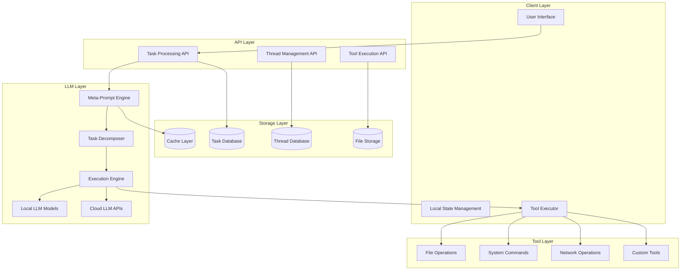
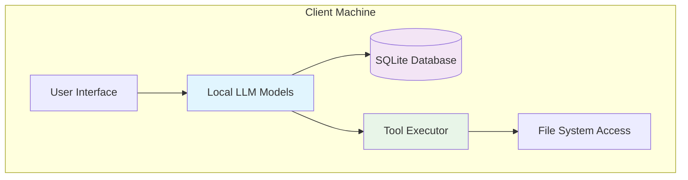
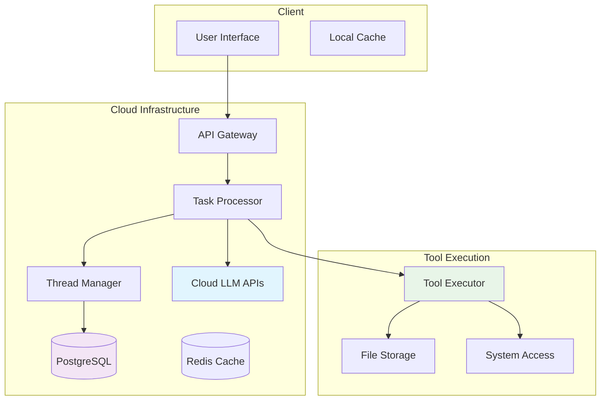
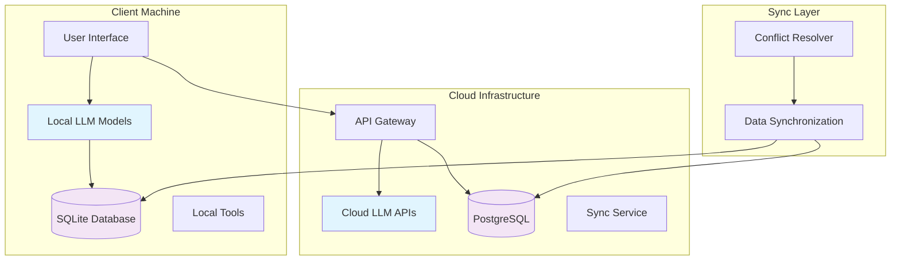

# General-Purpose Task Automation Architecture

## Executive Summary

This document provides a comprehensive architecture for building a general-purpose task automation system similar to Cursor AI or Lovable, but focused on **general-purpose task automation** beyond coding. The system will support project planning, documentation writing, meeting analysis, file organization, IT task assistance, and other business automation tasks.

## Table of Contents

1. [System Overview](#system-overview)
2. [Existing Codebase Analysis](#existing-codebase-analysis)
3. [Proposed Architecture](#proposed-architecture)
4. [LLM Workflow Design](#llm-workflow-design)
5. [Thread History & State Management](#thread-history--state-management)
6. [Deployment Architecture](#deployment-architecture)
7. [Technology Stack Recommendations](#technology-stack-recommendations)
8. [Security & Privacy Considerations](#security--privacy-considerations)
9. [Performance Optimization](#performance-optimization)
10. [Implementation Roadmap](#implementation-roadmap)

## System Overview

### Core Concept
A multi-step LLM workflow system that can:
- Decompose high-level user prompts into executable tasks
- Maintain conversation context across multiple steps
- Execute tools and actions based on structured LLM outputs
- Persist thread history for continuous improvement
- Support both local and cloud-based LLM models

### Target Use Cases
- **Project Planning**: Break down complex projects into actionable tasks
- **Documentation Writing**: Generate and organize technical documentation
- **Meeting Analysis**: Extract insights and action items from conversations
- **File Organization**: Intelligent file sorting and categorization
- **IT Task Assistance**: Troubleshooting, system configuration, automation
- **Business Process Automation**: Workflow optimization and task delegation

## Existing Codebase Analysis

### Current LLM Workflow Patterns in Action.IT

#### 1. Multi-Step Processing Pipeline
```typescript
// From process-transcripts/index.ts
async function processTranscript(transcriptId: string): Promise<any> {
  // Step 1: Fetch transcript data
  const transcriptData = await fetchTranscriptData(transcriptId);
  
  // Step 2: Download transcript text
  const transcriptText = await fetchTranscriptText(downloadUrl);
  
  // Step 3: Send to OpenAI Assistant for analysis
  const analysis = await analyzeTranscriptWithAssistant(transcriptText);
  
  // Step 4: Transform analysis into human-readable format
  const flattenedAnalysis = transformAnalysis(analysis);
  
  // Step 5: Store results in database
  await storeAnalysisResults(transcriptId, flattenedAnalysis);
}
```

#### 2. OpenAI Assistant Integration
```typescript
// Thread-based conversation management
const threadResponse = await fetch('https://api.openai.com/v1/threads', {
  method: 'POST',
  headers: {
    'Authorization': `Bearer ${openAIApiKey}`,
    'Content-Type': 'application/json',
    'OpenAI-Beta': 'assistants=v2',
  }
});

// Add messages to thread
const messageResponse = await fetch(`https://api.openai.com/v1/threads/${threadId}/messages`, {
  method: 'POST',
  headers: {
    'Authorization': `Bearer ${openAIApiKey}`,
    'Content-Type': 'application/json',
  },
  body: JSON.stringify({
    role: 'user',
    content: transcriptText
  })
});
```

#### 3. Database Schema for State Persistence
```sql
-- Existing patterns from Action.IT
CREATE TABLE transcripts (
  id UUID PRIMARY KEY,
  user_id UUID REFERENCES auth.users(id),
  meeting_id UUID REFERENCES meetings(id),
  transcript_text TEXT,
  open_ai_analysis JSONB,
  created_at TIMESTAMP WITH TIME ZONE DEFAULT NOW(),
  updated_at TIMESTAMP WITH TIME ZONE DEFAULT NOW()
);

CREATE TABLE key_insights (
  id UUID PRIMARY KEY,
  user_id UUID REFERENCES auth.users(id),
  meeting_id UUID REFERENCES meetings(id),
  insight_summary TEXT,
  action_items JSONB,
  decisions JSONB,
  created_at TIMESTAMP WITH TIME ZONE DEFAULT NOW()
);
```

#### 4. Edge Function Architecture
```typescript
// Serverless function pattern
serve(async (req) => {
  // CORS handling
  if (req.method === 'OPTIONS') {
    return new Response(null, { headers: corsHeaders, status: 204 });
  }

  try {
    const { action, data } = await req.json();
    
    switch (action) {
      case 'process-task':
        return await handleProcessTask(data);
      case 'execute-tool':
        return await handleExecuteTool(data);
      case 'get-thread-history':
        return await handleGetThreadHistory(data);
      default:
        throw new Error(`Unknown action: ${action}`);
    }
  } catch (error) {
    return new Response(
      JSON.stringify({ error: error.message }),
      { status: 400, headers: { ...corsHeaders, "Content-Type": "application/json" } }
    );
  }
});
```

## Proposed Architecture

### High-Level System Design



### Core Components

#### 1. Meta-Prompt Engine
```typescript
interface MetaPromptEngine {
  decomposeTask(userPrompt: string): TaskDecomposition;
  generateExecutionPlan(tasks: Task[]): ExecutionPlan;
  validateToolOutput(output: any): ValidationResult;
}

interface TaskDecomposition {
  tasks: Task[];
  dependencies: TaskDependency[];
  estimatedDuration: number;
  requiredTools: string[];
}

interface Task {
  id: string;
  type: 'analysis' | 'execution' | 'validation';
  prompt: string;
  requiredTools: string[];
  dependencies: string[];
  expectedOutput: string;
}
```

#### 2. Task Execution Engine
```typescript
interface ExecutionEngine {
  executeTask(task: Task, context: ExecutionContext): Promise<TaskResult>;
  executeTool(toolName: string, params: any): Promise<ToolResult>;
  validateResult(result: TaskResult, expectedOutput: string): ValidationResult;
}

interface ExecutionContext {
  threadId: string;
  previousResults: TaskResult[];
  userPreferences: UserPreferences;
  systemState: SystemState;
}
```

#### 3. Thread History Management
```typescript
interface ThreadManager {
  createThread(userId: string, initialPrompt: string): Promise<Thread>;
  addMessage(threadId: string, message: Message): Promise<void>;
  getThreadHistory(threadId: string): Promise<Message[]>;
  updateThreadState(threadId: string, state: ThreadState): Promise<void>;
}

interface Thread {
  id: string;
  userId: string;
  title: string;
  messages: Message[];
  state: ThreadState;
  createdAt: Date;
  updatedAt: Date;
}

interface Message {
  id: string;
  role: 'user' | 'assistant' | 'system' | 'tool';
  content: string;
  metadata: MessageMetadata;
  timestamp: Date;
}
```

## LLM Workflow Design

### 1. Meta-Prompt + Task Decomposition

```typescript
// Meta-prompt for task decomposition
const META_PROMPT = `
You are an AI task automation assistant. Your job is to break down complex user requests into executable tasks.

Given a user request, you must:
1. Analyze the request and identify the core objective
2. Break it down into sequential or parallel tasks
3. Identify required tools and resources
4. Estimate complexity and duration
5. Define success criteria for each task

Return a JSON object with this structure:
{
  "objective": "Clear description of the main goal",
  "tasks": [
    {
      "id": "unique-task-id",
      "type": "analysis|execution|validation",
      "description": "What this task accomplishes",
      "prompt": "Specific prompt for the LLM",
      "requiredTools": ["tool1", "tool2"],
      "dependencies": ["task-id-1", "task-id-2"],
      "estimatedDuration": 30,
      "successCriteria": "How to validate completion"
    }
  ],
  "executionPlan": {
    "parallel": ["task1", "task2"],
    "sequential": ["task3", "task4"],
    "estimatedTotalTime": 120
  }
}
`;

// Example task decomposition
const taskDecomposition = {
  objective: "Create a project plan for migrating legacy system to cloud",
  tasks: [
    {
      id: "analyze-current-system",
      type: "analysis",
      description: "Analyze current system architecture and dependencies",
      prompt: "Examine the provided system documentation and identify...",
      requiredTools: ["file-reader", "code-analyzer"],
      dependencies: [],
      estimatedDuration: 45,
      successCriteria: "Complete system dependency map generated"
    },
    {
      id: "identify-migration-risks",
      type: "analysis", 
      description: "Identify potential risks and mitigation strategies",
      prompt: "Based on the system analysis, identify potential risks...",
      requiredTools: ["risk-analyzer"],
      dependencies: ["analyze-current-system"],
      estimatedDuration: 30,
      successCriteria: "Risk assessment document created"
    }
  ]
};
```

### 2. Execution Loop with State Persistence

```typescript
class TaskExecutionEngine {
  async executeWorkflow(threadId: string, userPrompt: string): Promise<WorkflowResult> {
    // Step 1: Decompose the task
    const decomposition = await this.decomposeTask(userPrompt);
    
    // Step 2: Create execution plan
    const executionPlan = await this.createExecutionPlan(decomposition);
    
    // Step 3: Execute tasks with state persistence
    const results = new Map<string, TaskResult>();
    const context = await this.loadThreadContext(threadId);
    
    for (const taskGroup of executionPlan.taskGroups) {
      // Execute parallel tasks
      const parallelResults = await Promise.all(
        taskGroup.parallel.map(taskId => 
          this.executeTask(taskId, decomposition.tasks, results, context)
        )
      );
      
      // Update results
      parallelResults.forEach(result => {
        results.set(result.taskId, result);
      });
      
      // Persist intermediate state
      await this.persistThreadState(threadId, {
        completedTasks: Array.from(results.keys()),
        currentResults: Object.fromEntries(results),
        executionPlan: executionPlan
      });
    }
    
    // Step 4: Generate final summary
    const summary = await this.generateSummary(results, context);
    
    return {
      success: true,
      results: Object.fromEntries(results),
      summary: summary,
      executionTime: Date.now() - startTime
    };
  }
  
  private async executeTask(
    taskId: string, 
    tasks: Task[], 
    results: Map<string, TaskResult>,
    context: ExecutionContext
  ): Promise<TaskResult> {
    const task = tasks.find(t => t.id === taskId);
    if (!task) throw new Error(`Task ${taskId} not found`);
    
    // Check dependencies
    const missingDeps = task.dependencies.filter(dep => !results.has(dep));
    if (missingDeps.length > 0) {
      throw new Error(`Missing dependencies: ${missingDeps.join(', ')}`);
    }
    
    // Execute the task
    const result = await this.executeSingleTask(task, context, results);
    
    // Validate result
    const validation = await this.validateTaskResult(result, task);
    if (!validation.success) {
      throw new Error(`Task validation failed: ${validation.error}`);
    }
    
    return result;
  }
}
```

### 3. Tool Execution Framework

```typescript
interface ToolRegistry {
  registerTool(name: string, tool: Tool): void;
  getTool(name: string): Tool | null;
  listAvailableTools(): string[];
}

interface Tool {
  name: string;
  description: string;
  parameters: ToolParameter[];
  execute(params: any): Promise<ToolResult>;
  validate(params: any): ValidationResult;
}

// Example tools
class FileOperationsTool implements Tool {
  name = 'file-operations';
  description = 'Read, write, and manipulate files';
  parameters = [
    { name: 'operation', type: 'string', enum: ['read', 'write', 'delete', 'move'] },
    { name: 'path', type: 'string', description: 'File path' },
    { name: 'content', type: 'string', optional: true, description: 'File content for write operations' }
  ];
  
  async execute(params: any): Promise<ToolResult> {
    switch (params.operation) {
      case 'read':
        return await this.readFile(params.path);
      case 'write':
        return await this.writeFile(params.path, params.content);
      case 'delete':
        return await this.deleteFile(params.path);
      case 'move':
        return await this.moveFile(params.path, params.destination);
      default:
        throw new Error(`Unknown operation: ${params.operation}`);
    }
  }
}

class SystemCommandTool implements Tool {
  name = 'system-command';
  description = 'Execute system commands safely';
  parameters = [
    { name: 'command', type: 'string', description: 'Command to execute' },
    { name: 'timeout', type: 'number', optional: true, default: 30000 }
  ];
  
  async execute(params: any): Promise<ToolResult> {
    // Implement safe command execution with sandboxing
    return await this.executeCommand(params.command, params.timeout);
  }
}
```

## Thread History & State Management

### 1. Database Schema for Thread Persistence

```sql
-- Thread management tables
CREATE TABLE threads (
  id UUID PRIMARY KEY DEFAULT gen_random_uuid(),
  user_id UUID REFERENCES auth.users(id) ON DELETE CASCADE,
  title TEXT NOT NULL,
  status TEXT DEFAULT 'active' CHECK (status IN ('active', 'completed', 'failed', 'paused')),
  metadata JSONB DEFAULT '{}',
  created_at TIMESTAMP WITH TIME ZONE DEFAULT NOW(),
  updated_at TIMESTAMP WITH TIME ZONE DEFAULT NOW()
);

CREATE TABLE thread_messages (
  id UUID PRIMARY KEY DEFAULT gen_random_uuid(),
  thread_id UUID REFERENCES threads(id) ON DELETE CASCADE,
  role TEXT NOT NULL CHECK (role IN ('user', 'assistant', 'system', 'tool')),
  content TEXT NOT NULL,
  metadata JSONB DEFAULT '{}',
  created_at TIMESTAMP WITH TIME ZONE DEFAULT NOW()
);

CREATE TABLE task_executions (
  id UUID PRIMARY KEY DEFAULT gen_random_uuid(),
  thread_id UUID REFERENCES threads(id) ON DELETE CASCADE,
  task_id TEXT NOT NULL,
  task_type TEXT NOT NULL,
  status TEXT DEFAULT 'pending' CHECK (status IN ('pending', 'running', 'completed', 'failed')),
  input_data JSONB,
  output_data JSONB,
  error_message TEXT,
  execution_time_ms INTEGER,
  created_at TIMESTAMP WITH TIME ZONE DEFAULT NOW(),
  updated_at TIMESTAMP WITH TIME ZONE DEFAULT NOW()
);

CREATE TABLE tool_executions (
  id UUID PRIMARY KEY DEFAULT gen_random_uuid(),
  task_execution_id UUID REFERENCES task_executions(id) ON DELETE CASCADE,
  tool_name TEXT NOT NULL,
  parameters JSONB,
  result JSONB,
  execution_time_ms INTEGER,
  created_at TIMESTAMP WITH TIME ZONE DEFAULT NOW()
);

-- Indexes for performance
CREATE INDEX idx_threads_user_id ON threads(user_id);
CREATE INDEX idx_thread_messages_thread_id ON thread_messages(thread_id);
CREATE INDEX idx_task_executions_thread_id ON task_executions(thread_id);
CREATE INDEX idx_tool_executions_task_id ON tool_executions(task_execution_id);
```

### 2. Local vs Cloud Storage Strategy

#### Local Storage (SQLite)
```typescript
// For offline-first or privacy-conscious deployments
interface LocalStorageManager {
  initialize(): Promise<void>;
  saveThread(thread: Thread): Promise<void>;
  getThread(threadId: string): Promise<Thread | null>;
  saveMessage(threadId: string, message: Message): Promise<void>;
  getThreadMessages(threadId: string): Promise<Message[]>;
}

class SQLiteStorageManager implements LocalStorageManager {
  private db: Database;
  
  async initialize(): Promise<void> {
    this.db = new Database('task-automation.db');
    await this.createTables();
  }
  
  private async createTables(): Promise<void> {
    await this.db.exec(`
      CREATE TABLE IF NOT EXISTS threads (
        id TEXT PRIMARY KEY,
        user_id TEXT NOT NULL,
        title TEXT NOT NULL,
        status TEXT DEFAULT 'active',
        metadata TEXT,
        created_at TEXT,
        updated_at TEXT
      );
      
      CREATE TABLE IF NOT EXISTS thread_messages (
        id TEXT PRIMARY KEY,
        thread_id TEXT NOT NULL,
        role TEXT NOT NULL,
        content TEXT NOT NULL,
        metadata TEXT,
        created_at TEXT,
        FOREIGN KEY (thread_id) REFERENCES threads(id)
      );
    `);
  }
}
```

#### Cloud Storage (Supabase/PostgreSQL)
```typescript
// For collaborative and scalable deployments
class SupabaseStorageManager implements StorageManager {
  private supabase: SupabaseClient;
  
  async saveThread(thread: Thread): Promise<void> {
    const { error } = await this.supabase
      .from('threads')
      .upsert({
        id: thread.id,
        user_id: thread.userId,
        title: thread.title,
        status: thread.status,
        metadata: thread.metadata
      });
    
    if (error) throw error;
  }
  
  async getThread(threadId: string): Promise<Thread | null> {
    const { data, error } = await this.supabase
      .from('threads')
      .select('*')
      .eq('id', threadId)
      .single();
    
    if (error) throw error;
    return data ? this.mapToThread(data) : null;
  }
}
```

### 3. Hybrid Storage Strategy

```typescript
class HybridStorageManager implements StorageManager {
  private localManager: LocalStorageManager;
  private cloudManager: CloudStorageManager;
  private syncStrategy: SyncStrategy;
  
  constructor(
    localManager: LocalStorageManager,
    cloudManager: CloudStorageManager,
    syncStrategy: SyncStrategy
  ) {
    this.localManager = localManager;
    this.cloudManager = cloudManager;
    this.syncStrategy = syncStrategy;
  }
  
  async saveThread(thread: Thread): Promise<void> {
    // Save to local storage first for immediate availability
    await this.localManager.saveThread(thread);
    
    // Sync to cloud in background
    this.syncStrategy.scheduleSync(() => 
      this.cloudManager.saveThread(thread)
    );
  }
  
  async getThread(threadId: string): Promise<Thread | null> {
    // Try local first
    let thread = await this.localManager.getThread(threadId);
    
    if (!thread && this.syncStrategy.shouldSyncFromCloud()) {
      // Fallback to cloud
      thread = await this.cloudManager.getThread(threadId);
      
      // Cache locally if found
      if (thread) {
        await this.localManager.saveThread(thread);
      }
    }
    
    return thread;
  }
}
```

## Deployment Architecture

### 1. Local-Only Deployment



**Advantages:**
- Complete privacy and data sovereignty
- No internet dependency
- Low latency
- No cloud costs

**Requirements:**
- 8-16GB RAM for local LLM models
- GPU acceleration recommended
- Local model management

### 2. Cloud-Based Deployment



**Advantages:**
- Scalable and collaborative
- Access to powerful cloud LLMs
- Centralized management
- Real-time synchronization

### 3. Hybrid Deployment (Recommended)



**Advantages:**
- Best of both worlds
- Offline capability with cloud sync
- Privacy for sensitive data
- Scalability for collaboration
- Cost optimization

## Technology Stack Recommendations

### 1. Frontend Stack
```typescript
// Recommended: React + TypeScript + Vite
{
  "framework": "React 18",
  "language": "TypeScript",
  "buildTool": "Vite",
  "styling": "Tailwind CSS + ShadCN/UI",
  "stateManagement": "Zustand + React Query",
  "routing": "React Router",
  "ui": "Radix UI components"
}
```

### 2. Backend Stack Options

#### Option A: Node.js + Express (Recommended for Cloud)
```typescript
// Server-side architecture
{
  "runtime": "Node.js 18+",
  "framework": "Express.js",
  "database": "PostgreSQL (Supabase)",
  "cache": "Redis",
  "deployment": "Vercel/Netlify (Edge Functions)",
  "llm": "OpenAI API + Local Models"
}
```

#### Option B: Go + Gin (Recommended for Local)
```go
// High-performance local deployment
type Server struct {
    router     *gin.Engine
    db         *sql.DB
    llmClient  *LLMClient
    toolRegistry *ToolRegistry
}

func (s *Server) setupRoutes() {
    s.router.POST("/api/tasks", s.handleTaskExecution)
    s.router.GET("/api/threads/:id", s.handleGetThread)
    s.router.POST("/api/threads", s.handleCreateThread)
    s.router.POST("/api/tools/execute", s.handleToolExecution)
}
```

#### Option C: Python + FastAPI (Recommended for AI/ML)
```python
# AI-focused deployment
from fastapi import FastAPI, HTTPException
from pydantic import BaseModel
from typing import List, Optional

app = FastAPI()

class TaskRequest(BaseModel):
    prompt: str
    thread_id: Optional[str] = None
    user_preferences: Optional[dict] = None

@app.post("/api/tasks/execute")
async def execute_task(request: TaskRequest):
    # Task decomposition and execution
    pass
```

### 3. Database Options

#### Local Storage
```typescript
// SQLite for local deployment
{
  "database": "SQLite",
  "orm": "Prisma or Drizzle ORM",
  "migrations": "Automatic schema management",
  "backup": "File-based backup strategy"
}
```

#### Cloud Storage
```typescript
// PostgreSQL for cloud deployment
{
  "database": "PostgreSQL (Supabase)",
  "orm": "Prisma or TypeORM",
  "realtime": "Supabase Realtime subscriptions",
  "backup": "Automated cloud backups"
}
```

### 4. LLM Integration

#### Local Models
```typescript
// Local LLM options
{
  "lightweight": "Ollama (Llama 2, Mistral)",
  "performance": "LocalAI (GPT-4 compatible)",
  "specialized": "CodeLlama for coding tasks",
  "memory": "4-8GB RAM requirement"
}
```

#### Cloud Models
```typescript
// Cloud LLM options
{
  "openai": "GPT-4, GPT-3.5-turbo",
  "anthropic": "Claude-3, Claude-2",
  "google": "Gemini Pro",
  "cost": "Pay-per-token pricing"
}
```

## Security & Privacy Considerations

### 1. Data Protection
```typescript
// Encryption at rest and in transit
interface SecurityManager {
  encryptData(data: any): Promise<string>;
  decryptData(encryptedData: string): Promise<any>;
  hashSensitiveData(data: string): string;
  validateInput(input: any): ValidationResult;
}

class SecurityManagerImpl implements SecurityManager {
  private encryptionKey: CryptoKey;
  
  async encryptData(data: any): Promise<string> {
    const jsonData = JSON.stringify(data);
    const encoder = new TextEncoder();
    const dataBuffer = encoder.encode(jsonData);
    
    const iv = crypto.getRandomValues(new Uint8Array(12));
    const encryptedData = await crypto.subtle.encrypt(
      { name: 'AES-GCM', iv },
      this.encryptionKey,
      dataBuffer
    );
    
    return btoa(JSON.stringify({
      iv: Array.from(iv),
      data: Array.from(new Uint8Array(encryptedData))
    }));
  }
}
```

### 2. Tool Execution Security
```typescript
// Sandboxed tool execution
class SecureToolExecutor {
  private sandbox: Sandbox;
  
  async executeTool(toolName: string, params: any): Promise<ToolResult> {
    // Validate tool permissions
    const tool = this.toolRegistry.getTool(toolName);
    if (!tool) throw new Error(`Tool ${toolName} not found`);
    
    // Validate parameters
    const validation = tool.validate(params);
    if (!validation.success) {
      throw new Error(`Invalid parameters: ${validation.error}`);
    }
    
    // Execute in sandbox
    return await this.sandbox.execute(() => tool.execute(params));
  }
}

class Sandbox {
  async execute<T>(fn: () => Promise<T>): Promise<T> {
    // Implement sandboxing logic
    // - Resource limits
    // - File system restrictions
    // - Network access controls
    // - Timeout enforcement
    return await fn();
  }
}
```

### 3. Privacy Controls
```typescript
// User privacy settings
interface PrivacySettings {
  dataRetention: '7days' | '30days' | '90days' | 'forever';
  cloudSync: boolean;
  localOnly: boolean;
  anonymizeData: boolean;
  exportData: boolean;
}

class PrivacyManager {
  async applyPrivacySettings(settings: PrivacySettings): Promise<void> {
    // Implement privacy controls
    if (settings.localOnly) {
      await this.disableCloudSync();
    }
    
    if (settings.anonymizeData) {
      await this.anonymizeExistingData();
    }
    
    await this.setDataRetention(settings.dataRetention);
  }
}
```

## Performance Optimization

### 1. Caching Strategy
```typescript
// Multi-level caching
class CacheManager {
  private memoryCache: Map<string, any> = new Map();
  private diskCache: DiskCache;
  private cloudCache: CloudCache;
  
  async get(key: string): Promise<any | null> {
    // Check memory cache first
    if (this.memoryCache.has(key)) {
      return this.memoryCache.get(key);
    }
    
    // Check disk cache
    const diskResult = await this.diskCache.get(key);
    if (diskResult) {
      this.memoryCache.set(key, diskResult);
      return diskResult;
    }
    
    // Check cloud cache
    const cloudResult = await this.cloudCache.get(key);
    if (cloudResult) {
      await this.diskCache.set(key, cloudResult);
      this.memoryCache.set(key, cloudResult);
      return cloudResult;
    }
    
    return null;
  }
}
```

### 2. LLM Model Optimization
```typescript
// Model selection based on task complexity
class ModelSelector {
  async selectModel(task: Task, userPreferences: UserPreferences): Promise<LLMModel> {
    const complexity = this.assessTaskComplexity(task);
    const availableModels = await this.getAvailableModels();
    
    if (complexity === 'simple' && userPreferences.localOnly) {
      return availableModels.find(m => m.type === 'local' && m.size === 'small');
    }
    
    if (complexity === 'complex' && userPreferences.performance) {
      return availableModels.find(m => m.type === 'cloud' && m.capability === 'high');
    }
    
    // Default to balanced model
    return availableModels.find(m => m.type === 'balanced');
  }
}
```

### 3. Resource Management
```typescript
// Resource monitoring and optimization
class ResourceManager {
  private memoryUsage: number = 0;
  private cpuUsage: number = 0;
  
  async monitorResources(): Promise<ResourceStatus> {
    const currentMemory = await this.getMemoryUsage();
    const currentCPU = await this.getCPUUsage();
    
    return {
      memory: {
        used: currentMemory,
        available: this.maxMemory - currentMemory,
        percentage: (currentMemory / this.maxMemory) * 100
      },
      cpu: {
        usage: currentCPU,
        cores: this.cpuCores
      }
    };
  }
  
  async optimizeForPerformance(): Promise<void> {
    const status = await this.monitorResources();
    
    if (status.memory.percentage > 80) {
      await this.clearMemoryCache();
    }
    
    if (status.cpu.usage > 90) {
      await this.throttleNonEssentialTasks();
    }
  }
}
```

## Implementation Roadmap

### Phase 1: Core Infrastructure (4-6 weeks)
- [ ] Set up basic project structure
- [ ] Implement thread management system
- [ ] Create task decomposition engine
- [ ] Build basic tool execution framework
- [ ] Set up local storage (SQLite)

### Phase 2: LLM Integration (3-4 weeks)
- [ ] Integrate OpenAI API
- [ ] Add local LLM support (Ollama)
- [ ] Implement meta-prompt system
- [ ] Create task execution engine
- [ ] Add result validation

### Phase 3: Tool Ecosystem (4-5 weeks)
- [ ] Implement file operation tools
- [ ] Add system command tools
- [ ] Create network operation tools
- [ ] Build custom tool framework
- [ ] Add tool security sandboxing

### Phase 4: User Interface (3-4 weeks)
- [ ] Design and implement main UI
- [ ] Create thread management interface
- [ ] Build task execution dashboard
- [ ] Add settings and preferences
- [ ] Implement real-time updates

### Phase 5: Advanced Features (4-6 weeks)
- [ ] Add cloud synchronization
- [ ] Implement collaborative features
- [ ] Create advanced analytics
- [ ] Add plugin system
- [ ] Performance optimization

### Phase 6: Production Deployment (2-3 weeks)
- [ ] Security hardening
- [ ] Performance testing
- [ ] Documentation completion
- [ ] Deployment automation
- [ ] Monitoring and logging

## File Structure Example

```
task-automation-system/
├── src/
│   ├── core/
│   │   ├── TaskEngine.ts
│   │   ├── ThreadManager.ts
│   │   ├── ToolRegistry.ts
│   │   └── ModelSelector.ts
│   ├── llm/
│   │   ├── MetaPromptEngine.ts
│   │   ├── TaskDecomposer.ts
│   │   ├── ExecutionEngine.ts
│   │   └── LocalLLMClient.ts
│   ├── tools/
│   │   ├── FileOperationsTool.ts
│   │   ├── SystemCommandTool.ts
│   │   ├── NetworkTool.ts
│   │   └── CustomTool.ts
│   ├── storage/
│   │   ├── LocalStorageManager.ts
│   │   ├── CloudStorageManager.ts
│   │   └── HybridStorageManager.ts
│   ├── ui/
│   │   ├── components/
│   │   ├── pages/
│   │   └── hooks/
│   └── utils/
│       ├── SecurityManager.ts
│       ├── CacheManager.ts
│       └── ResourceManager.ts
├── server/
│   ├── api/
│   ├── middleware/
│   └── services/
├── database/
│   ├── migrations/
│   ├── schema.sql
│   └── seed.sql
├── config/
│   ├── local.ts
│   ├── development.ts
│   └── production.ts
└── docs/
    ├── API.md
    ├── DEPLOYMENT.md
    └── SECURITY.md
```

## Conclusion

This architecture provides a solid foundation for building a general-purpose task automation system that can:

1. **Scale from local to cloud** based on user needs and privacy requirements
2. **Maintain conversation context** across complex multi-step workflows
3. **Execute tools safely** with proper sandboxing and security controls
4. **Optimize performance** through intelligent caching and resource management
5. **Support enterprise deployment** with security, compliance, and collaboration features

The hybrid approach with local-first capabilities and optional cloud synchronization offers the best balance of privacy, performance, and scalability for enterprise environments while maintaining the flexibility to work offline when needed. 