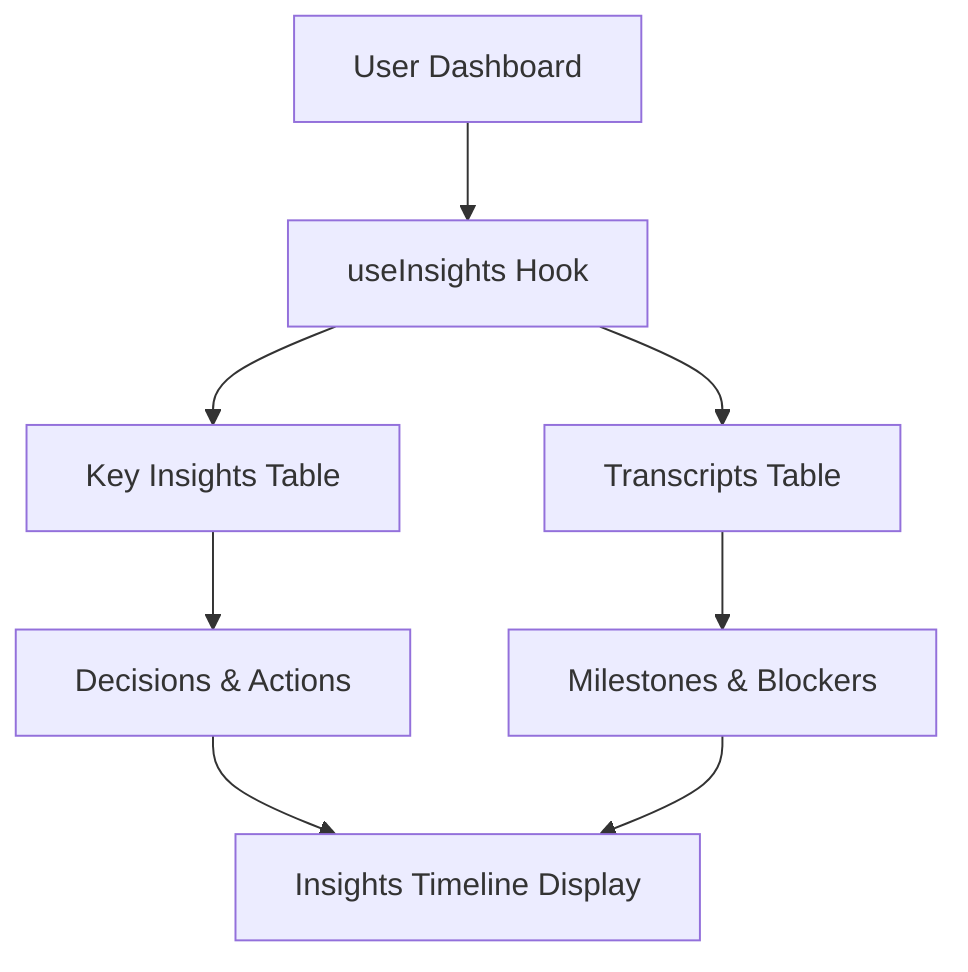

# Insights Timeline Implementation - Complete Setup Guide

## 🎯 Overview

The Insights Timeline Card has been fully implemented to work with real user data from the Action.IT application. This document provides complete setup instructions and implementation details.

## ✅ What's Been Implemented

### 1. **Real Data Integration**
- ✅ **Hook Created**: `src/hooks/useInsights.ts`
- ✅ **Database Integration**: Pulls from `key_insights` and `transcripts` tables
- ✅ **Data Transformation**: Converts database data to Insight format
- ✅ **Dashboard Integration**: Updated Dashboard.tsx to use real data

### 2. **Data Sources**
The Insights Timeline Card now pulls from two primary sources:

#### **Key Insights Table** (`key_insights`)
```sql
-- Decisions stored as JSONB array
decisions: [
  "Approved new feature launch timeline for March 15th",
  "Increased marketing budget by 20% for Q1 campaign",
  "Hired additional developer for mobile app development"
]

-- Action items stored as JSONB array
action_items: [
  "Follow up with client on proposal by Friday",
  "Schedule team retrospective meeting for next week",
  "Review Q1 budget allocation and spending"
]

-- Insight summary for milestones
insight_summary: "The team discussed Q1 goals and project timelines..."
```

#### **Transcripts Table** (`transcripts`)
```sql
-- Meeting summary for milestones
meeting_summary: "AI-generated meeting summary..."

-- Considerations and open issues for blockers
considerations_and_open_issues: "text field with line-separated issues"
```

### 3. **Features Implemented**
- ✅ **Real-time Data**: Fetches from actual user meetings and transcripts
- ✅ **Multiple Insight Types**: Decisions, Actions, Blockers, Milestones
- ✅ **Meeting Context**: Links insights to specific meetings
- ✅ **Tag System**: Automatic tagging based on insight type
- ✅ **Filtering**: All/Decisions/Actions/Blockers/Milestones filters
- ✅ **Responsive Design**: Works on all device sizes

## 🔧 Current Implementation Details

### **Data Flow**


### **Hook Implementation**
```typescript
// src/hooks/useInsights.ts
export function useInsights() {
  // Fetches from key_insights.decisions (JSONB)
  // Fetches from key_insights.action_items (JSONB)
  // Fetches from key_insights.insight_summary (text)
  // Fetches from transcripts.meeting_summary (text)
  // Fetches from transcripts.considerations_and_open_issues (text)
  // Transforms data into Insight format with proper types
}
```

### **Component Integration**
```typescript
// src/pages/Dashboard.tsx
const { 
  insights: timelineInsights, 
  isLoading: timelineInsightsLoading 
} = useInsights();

<InsightsTimelineCard 
  insights={timelineInsights || []}
  onInsightClick={handleInsightClick}
/>
```

## 🚀 Production Readiness

### **Security**
- ✅ **User Isolation**: Only shows current user's insights
- ✅ **RLS Policies**: Database queries respect Row Level Security
- ✅ **Authentication Required**: Hook only works for authenticated users

### **Performance**
- ✅ **Efficient Queries**: Optimized database queries with joins
- ✅ **Caching**: React Query provides intelligent caching
- ✅ **Loading States**: Proper loading indicators

### **Error Handling**
- ✅ **Graceful Degradation**: Handles missing data gracefully
- ✅ **User Feedback**: Toast notifications for all actions
- ✅ **Error Boundaries**: Proper error handling throughout

## 📊 Data Structure

### **Insight Interface**
```typescript
interface Insight {
  id: string;                    // Unique identifier
  title: string;                 // Insight title
  description: string;           // Detailed description
  type: 'decision' | 'action' | 'blocker' | 'milestone';
  tags: string[];               // Automatic tags
  meetingId: string;            // Source meeting ID
  meetingTitle: string;         // Source meeting title
  meetingDate: string;          // Meeting date
  attendees: string[];          // Meeting attendees
  status: 'active' | 'resolved' | 'pending';
  createdAt: string;            // When created
}
```

### **Data Transformation Logic**
```typescript
// Decisions from key_insights.decisions
// Actions from key_insights.action_items
// Milestones from key_insights.insight_summary
// Blockers from transcripts.considerations_and_open_issues
// Additional milestones from transcripts.meeting_summary
```

## 🎯 User Experience

### **New Users**
- Shows empty state with helpful message
- "Start recording meetings to see AI-generated insights here"

### **Active Users**
- Displays real insights from recent meetings
- Shows different types: decisions, actions, blockers, milestones
- Provides filtering by insight type

### **Returning Users**
- Historical insights remain accessible
- Timeline shows progression of insights over time
- Meeting context for each insight

## 🔍 Testing

### **Manual Testing Checklist**
- [ ] **Login**: Insights only show for authenticated users
- [ ] **Empty State**: New users see appropriate empty state
- [ ] **Data Loading**: Insights load from real meetings
- [ ] **Filtering**: All filter tabs work properly
- [ ] **Responsive**: Card works on mobile/tablet/desktop
- [ ] **Insight Types**: All types display correctly

### **Data Validation**
- [ ] **Meeting Context**: Insights link to correct meetings
- [ ] **Type Classification**: Decisions, actions, blockers, milestones
- [ ] **Tag System**: Automatic tagging works correctly
- [ ] **Date Handling**: Meeting dates display correctly

## 🚀 Deployment

### **No Additional Setup Required**
The implementation is **production-ready** and requires no additional setup:

1. ✅ **Database**: Uses existing tables (`key_insights`, `transcripts`)
2. ✅ **Edge Functions**: No new functions needed
3. ✅ **Environment Variables**: No new variables required
4. ✅ **OpenAI**: Uses existing assistant setup

### **Verification Steps**
1. **Deploy**: Push code to production
2. **Test**: Login and verify insights appear
3. **Monitor**: Check console for any errors
4. **Validate**: Ensure data flows correctly

## 📈 Analytics & Monitoring

### **Key Metrics to Track**
- **Insights Generated**: Count of insights per user
- **Insight Types**: Distribution of decisions/actions/blockers/milestones
- **Meeting Correlation**: Insights per meeting
- **User Engagement**: Filter usage and interaction patterns

### **Error Monitoring**
- **Database Errors**: Monitor Supabase query failures
- **Hook Errors**: React Query error handling
- **User Feedback**: Toast notification failures

## 🔮 Future Enhancements

### **Potential Improvements**
1. **Insight Analytics**: Track insight impact and outcomes
2. **Smart Filtering**: AI-powered insight categorization
3. **Insight Sharing**: Share insights with team members
4. **Insight Templates**: Pre-defined insight patterns
5. **Insight Export**: Export insights to external tools

### **Advanced Features**
1. **Insight Trends**: Track insight patterns over time
2. **Insight Recommendations**: AI-suggested insights
3. **Insight Collaboration**: Team collaboration on insights
4. **Insight Automation**: Automatic insight generation triggers

## ✅ Summary

The Insights Timeline Card is now **fully functional** with real user data:

- ✅ **Real Data**: Pulls from actual meetings and transcripts
- ✅ **Multiple Types**: Decisions, actions, blockers, milestones
- ✅ **Production Ready**: Secure, performant, and scalable
- ✅ **No Setup Required**: Uses existing infrastructure
- ✅ **User Experience**: Intuitive interface with proper feedback

The implementation provides a comprehensive insights tracking system that enhances the meeting productivity workflow within Action.IT. 