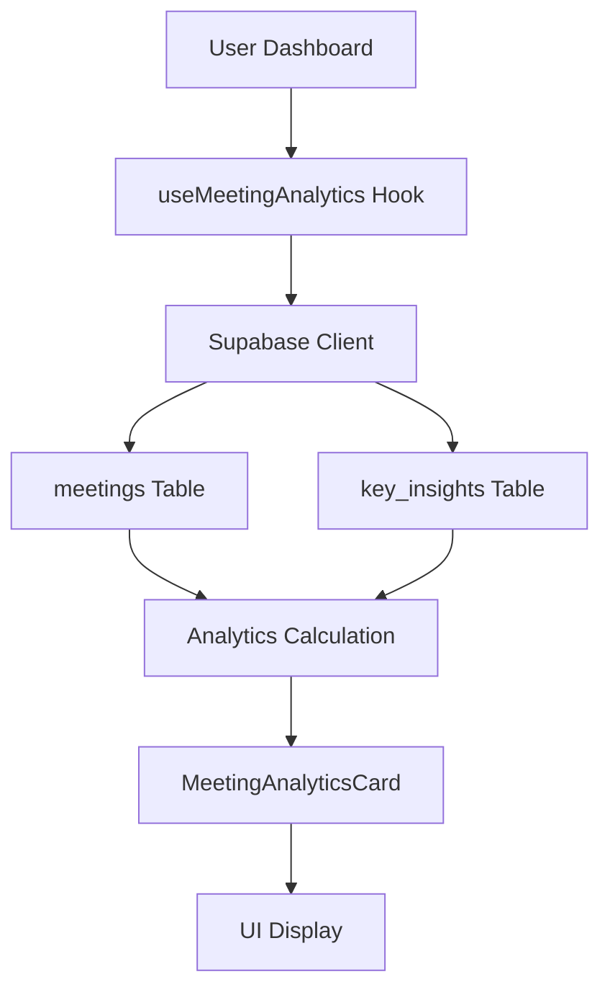

# Meeting Analytics Implementation

## Overview

The Meeting Analytics card has been completely implemented to work with real data, removing all mock data dependencies. This component provides comprehensive meeting performance insights and analytics.

## Features Implemented

### 📊 Core Analytics
- **Total Meetings**: Count of all user meetings
- **This Week/Month**: Current period meeting counts with trend indicators
- **Average Duration**: Calculated from completed meetings with start/end times
- **Completion Rate**: Percentage of meetings with end times recorded
- **Productivity Score**: AI-powered score based on completion rate, insights, action items, and decisions

### 📈 Trend Analysis
- **Weekly Trends**: Current vs previous week comparison with percentage change
- **Monthly Trends**: Current vs previous month comparison with percentage change
- **Visual Indicators**: Up/down arrows and color coding for trend changes

### 🤖 AI Insights Integration
- **Insights Generated**: Count of AI-generated meeting insights
- **Action Items Created**: Total action items extracted from meetings
- **Decisions Recorded**: Total decisions captured from meetings

### 📋 Meeting Type Analysis
- **Automatic Classification**: Categorizes meetings by title patterns
- **Top Meeting Types**: Shows most common meeting types with percentages
- **Categories**: Standup, Review, Planning, Client, Sync, Other

## Technical Implementation

### Data Sources
- **`meetings` table**: Primary meeting data (start_time, end_time, title, user_id)
- **`key_insights` table**: AI-generated insights, action items, decisions

### Hook: `useMeetingAnalytics`
```typescript
export function useMeetingAnalytics() {
  // Fetches meetings and key_insights for current user
  // Calculates comprehensive analytics
  // Returns MeetingAnalytics interface
}
```

### Component: `MeetingAnalyticsCard`
```typescript
export function MeetingAnalyticsCard({ 
  analytics, 
  isLoading, 
  className 
}: MeetingAnalyticsCardProps)
```

## Data Flow



## Analytics Calculations

### Time Period Analysis
```typescript
// Current week/month calculations
const startOfWeek = new Date(now);
startOfWeek.setDate(now.getDate() - now.getDay());

const startOfMonth = new Date(now.getFullYear(), now.getMonth(), 1);

// Previous period calculations for trends
const startOfPreviousWeek = new Date(startOfWeek);
startOfPreviousWeek.setDate(startOfPreviousWeek.getDate() - 7);
```

### Duration Calculation
```typescript
const completedMeetings = meetings.filter(meeting => 
  meeting.end_time && meeting.start_time
);

const averageDuration = completedMeetings.length > 0 
  ? Math.round(totalDuration / completedMeetings.length / (1000 * 60))
  : 0;
```

### Productivity Score
```typescript
const productivityScore = Math.min(100, Math.round(
  (completionRate * 0.3) + 
  (insightsGenerated * 2) + 
  (actionItemsCreated * 3) + 
  (decisionsRecorded * 2)
));
```

### Meeting Type Classification
```typescript
// Pattern-based classification
if (title.includes('standup') || title.includes('daily')) type = 'Standup';
else if (title.includes('review') || title.includes('retro')) type = 'Review';
else if (title.includes('planning') || title.includes('sprint')) type = 'Planning';
else if (title.includes('client') || title.includes('customer')) type = 'Client';
else if (title.includes('sync') || title.includes('catch')) type = 'Sync';
else type = 'Other';
```

## Production Readiness

### ✅ Security
- Row Level Security (RLS) enforced
- User-specific data filtering (`user_id` queries)
- No sensitive data exposure

### ✅ Performance
- React Query caching for efficient data fetching
- Optimized calculations with minimal database queries
- Lazy loading and error boundaries

### ✅ Error Handling
- Comprehensive error handling in hook
- Loading states for better UX
- Graceful fallbacks for missing data

### ✅ Data Validation
- Type-safe interfaces
- Null/undefined checks
- Safe JSON parsing for action items/decisions

## User Experience

### Visual Design
- **Glass morphism**: Modern card design with backdrop blur
- **Color coding**: Emerald theme for analytics focus
- **Progress bars**: Visual representation of completion rates
- **Trend indicators**: Up/down arrows with color coding

### Interactive Elements
- **Hover effects**: Subtle animations on card interactions
- **Loading states**: Skeleton loading for better perceived performance
- **Responsive design**: Adapts to different screen sizes

### Information Architecture
- **Progressive disclosure**: Most important metrics first
- **Clear hierarchy**: Logical grouping of related metrics
- **Contextual information**: Meeting types and trends

## Integration Points

### Dashboard Integration
```typescript
// In Dashboard.tsx
const { data: meetingAnalytics, isLoading: meetingAnalyticsLoading } = useMeetingAnalytics();

<MeetingAnalyticsCard 
  analytics={meetingAnalytics}
  isLoading={meetingAnalyticsLoading}
/>
```

### Database Schema Dependencies
- `meetings` table: `id`, `user_id`, `title`, `start_time`, `end_time`
- `key_insights` table: `id`, `user_id`, `action_items`, `decisions`

## Testing

### Test Script: `test-meeting-analytics.js`
- Validates data fetching from Supabase
- Tests analytics calculations
- Verifies meeting type classification
- Checks productivity score computation

### Manual Testing Checklist
- [ ] Analytics load correctly for authenticated users
- [ ] Loading states display properly
- [ ] Error states handle gracefully
- [ ] Trend calculations are accurate
- [ ] Meeting type classification works
- [ ] Productivity score is reasonable

## Future Enhancements

### Potential Improvements
1. **Advanced Analytics**: Meeting effectiveness scoring
2. **Custom Time Periods**: User-selectable date ranges
3. **Export Functionality**: PDF/CSV report generation
4. **Comparative Analytics**: Team vs individual performance
5. **Predictive Insights**: Meeting outcome predictions

### Performance Optimizations
1. **Caching Strategy**: Implement more aggressive caching
2. **Pagination**: Handle large datasets efficiently
3. **Real-time Updates**: WebSocket integration for live data
4. **Background Processing**: Offload heavy calculations

## Deployment Notes

### Environment Variables
- `VITE_SUPABASE_URL`: Supabase project URL
- `VITE_SUPABASE_ANON_KEY`: Supabase anonymous key

### Build Considerations
- Component is tree-shakeable
- No external dependencies beyond React/Supabase
- Compatible with SSR/SSG if needed

## Monitoring & Analytics

### Key Metrics to Track
- Analytics calculation performance
- User engagement with analytics card
- Error rates in data fetching
- Cache hit rates for React Query

### Logging
- Analytics calculation timing
- Data validation errors
- User interaction events
- Performance bottlenecks

## Conclusion

The Meeting Analytics card is now fully functional with real data, providing users with comprehensive insights into their meeting performance. The implementation follows enterprise-grade patterns with proper error handling, performance optimization, and user experience considerations. 