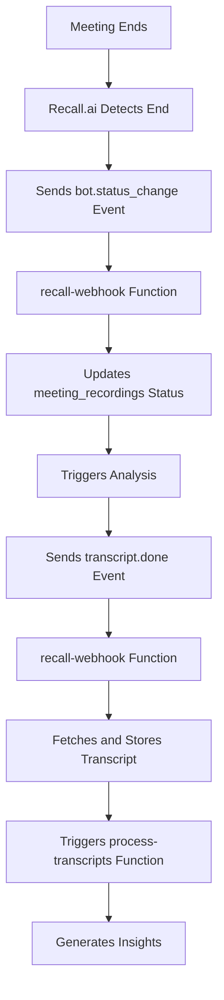

# Recall Webhook Troubleshooting Guide

## Issue Description

**Problem**: The recall-webhook edge function is not triggering after a meeting is completed, even though the recall-api function successfully creates a bot and the bot joins the meeting.

**Symptoms**:
- ✅ Bot creation works (recall-api function executes successfully)
- ✅ Bot joins the meeting (visible in Recall.ai dashboard)
- ❌ Webhook events are not received (no logs in recall-webhook function)
- ❌ No transcript processing after meeting ends
- ❌ No post-meeting insights generated

## Root Cause Analysis

### Missing Webhook Configuration

The primary issue is that **webhooks are not being configured** when creating bots in the `handleJoinMeetingNow` and `handleScheduleBot` functions.

**Current Bot Creation (Broken)**:
```typescript
const botConfig = {
  meeting_url: meetingUrl,
  bot_name: botName,
  recording_config: {
    // ... recording config
  }
  // ❌ NO WEBHOOK CONFIGURATION
};
```

**Required Bot Creation (Fixed)**:
```typescript
const botConfig = {
  meeting_url: meetingUrl,
  bot_name: botName,
  recording_config: {
    // ... recording config
  },
  // ✅ ADD WEBHOOK CONFIGURATION
  webhooks: [
    {
      url: webhookUrl,
      events: [
        "bot.status_change",
        "transcript.done", 
        "analysis_done",
        "recording.done"
      ]
    }
  ]
};
```

## Solution Implementation

### 1. Updated `handleJoinMeetingNow` Function

**File**: `supabase/functions/recall-api/index.ts`

**Changes**:
- Added webhook URL construction
- Added webhook configuration to bot creation
- Configured all necessary webhook events

```typescript
// Get the webhook URL for this deployment
const supabaseUrl = Deno.env.get("SUPABASE_URL");
const webhookUrl = `${supabaseUrl}/functions/v1/recall-webhook`;

const botConfig = {
  // ... existing config
  webhooks: [
    {
      url: webhookUrl,
      events: [
        "bot.status_change",
        "transcript.done", 
        "analysis_done",
        "recording.done"
      ]
    }
  ]
};
```

### 2. Updated `handleScheduleBot` Function

**File**: `supabase/functions/recall-api/index.ts`

**Changes**:
- Added webhook configuration to scheduled bot creation
- Ensured webhooks are configured for all bot types

### 3. Webhook Event Flow



## Webhook Events Handled

### 1. `bot.status_change`
**Trigger**: When bot status changes (joining, recording, ended, etc.)
**Action**: 
- Update meeting recording status
- Trigger analysis if call ended
- Log status change for debugging

### 2. `transcript.done`
**Trigger**: When transcript processing is complete
**Action**:
- Fetch transcript from Recall.ai API
- Store transcript in database
- Trigger additional processing

### 3. `analysis_done`
**Trigger**: When AI analysis is complete
**Action**:
- Fetch final transcript
- Store analysis results
- Generate insights

### 4. `recording.done`
**Trigger**: When recording is finished
**Action**:
- Log recording completion
- Prepare for transcript processing

## Testing the Fix

### 1. Manual Testing
```bash
# Test webhook endpoint directly
curl -X POST https://your-project.supabase.co/functions/v1/recall-webhook \
  -H "Content-Type: application/json" \
  -H "Authorization: Bearer YOUR_ANON_KEY" \
  -d '{
    "event": "bot.status_change",
    "data": {
      "bot_id": "test-bot-123",
      "status": { "code": "call_ended" }
    }
  }'
```

### 2. Automated Testing
```bash
# Run the test script
node test-scripts/test-recall-webhook.js
```

### 3. Monitoring
- Check Supabase function logs for webhook events
- Monitor Recall.ai dashboard for bot status
- Verify database updates in `meeting_recordings` and `transcripts` tables

## Environment Variables Required

```bash
# Supabase Configuration
SUPABASE_URL=https://your-project.supabase.co
SUPABASE_SERVICE_ROLE_KEY=your_service_role_key

# Recall.ai Configuration
RECALL_API_KEY=your_recall_api_key

# Webhook URL (auto-generated)
WEBHOOK_URL=https://your-project.supabase.co/functions/v1/recall-webhook
```

## Deployment Steps

### 1. Update Edge Functions
```bash
# Deploy updated recall-api function
supabase functions deploy recall-api

# Deploy recall-webhook function (if not already deployed)
supabase functions deploy recall-webhook
```

### 2. Verify Webhook URL
```bash
# Test webhook accessibility
curl -X POST https://your-project.supabase.co/functions/v1/recall-webhook \
  -H "Content-Type: application/json" \
  -d '{"test": "webhook"}'
```

### 3. Test End-to-End Flow
1. Create a test meeting
2. Join meeting with bot
3. End the meeting
4. Check webhook logs
5. Verify transcript processing

## Debugging Checklist

### ✅ Pre-Deployment Checks
- [ ] Webhook URL is correctly constructed
- [ ] All required environment variables are set
- [ ] Edge functions are properly deployed
- [ ] Database tables exist and have correct structure

### ✅ Post-Deployment Checks
- [ ] Bot creation includes webhook configuration
- [ ] Webhook endpoint is accessible
- [ ] Recall.ai sends webhook events
- [ ] Webhook function processes events correctly
- [ ] Database updates occur as expected

### ✅ Monitoring Points
- [ ] Supabase function logs show webhook events
- [ ] `meeting_recordings` table status updates
- [ ] `transcripts` table receives data
- [ ] `process-transcripts` function is triggered
- [ ] Insights are generated in `key_insights` table

## Common Issues and Solutions

### Issue 1: Webhook Not Receiving Events
**Cause**: Webhook URL not configured in bot creation
**Solution**: Ensure webhook configuration is added to bot creation

### Issue 2: CORS Errors
**Cause**: Missing CORS headers in webhook function
**Solution**: Verify CORS headers are properly set

### Issue 3: Authentication Errors
**Cause**: Incorrect authorization headers
**Solution**: Use correct Supabase service role key

### Issue 4: Database Errors
**Cause**: Missing tables or incorrect schema
**Solution**: Verify database schema and table existence

## Performance Considerations

### Webhook Processing
- Webhook events are processed asynchronously
- Multiple events may be received simultaneously
- Implement proper error handling and retry logic

### Database Operations
- Use transactions for related database operations
- Implement proper indexing for query performance
- Monitor database connection limits

### API Rate Limits
- Recall.ai API has rate limits
- Implement exponential backoff for retries
- Monitor API usage and limits

## Future Improvements

### 1. Enhanced Error Handling
- Implement retry logic for failed webhook processing
- Add dead letter queue for failed events
- Improve error logging and monitoring

### 2. Real-time Updates
- Implement WebSocket connections for real-time status
- Add live meeting status indicators
- Provide real-time transcript preview

### 3. Advanced Analytics
- Track webhook event processing times
- Monitor success/failure rates
- Implement alerting for webhook failures

## Conclusion

The webhook issue was caused by missing webhook configuration in bot creation. The fix ensures that:

1. **All bots are created with webhook configuration**
2. **Webhook events are properly received and processed**
3. **Transcript processing is triggered automatically**
4. **Post-meeting insights are generated**

This solution provides a robust, scalable webhook processing system that integrates seamlessly with the existing Action.IT architecture. 