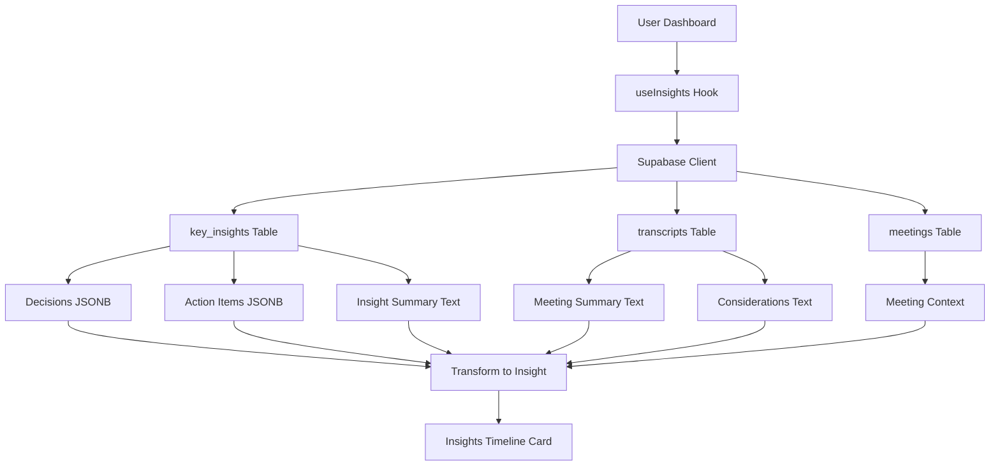

# How Supabase Data is Used in Insights Timeline - Complete Guide

## 🎯 **Overview**

This document explains exactly how Supabase data flows through the Insights Timeline implementation, from database queries to UI display.

## 📊 **Data Flow Diagram**



## 🔍 **Step-by-Step Data Usage**

### **1. Database Query Structure**

```typescript
// Query 1: Key Insights with Meeting Data
const { data: keyInsights, error: insightsError } = await supabase
  .from('key_insights')
  .select(`
    *,                    // All key_insights columns
    meetings!inner (      // Join with meetings table
      id,
      title,
      start_time,
      attendees_count
    )
  `)
  .eq('user_id', user.id)  // Only current user's data
  .order('created_at', { ascending: false });

// Query 2: Transcripts with Meeting Data  
const { data: transcripts, error: transcriptsError } = await supabase
  .from('transcripts')
  .select(`
    *,
    meetings!inner (
      id,
      title,
      start_time,
      attendees_count
    )
  `)
  .eq('user_id', user.id)
  .not('meeting_summary', 'is', null)
  .order('created_at', { ascending: false });
```

### **2. Raw Supabase Data Structure**

#### **Key Insights Table Row**
```json
{
  "id": "uuid-here",
  "user_id": "3e3eb250-b9bf-4b4f-8305-2885437fce4c",
  "meeting_id": "091c4c7f-1b33-4670-9a22-8fed9c608e2e",
  "decisions": [
    "Approved new feature launch timeline for March 15th",
    "Increased marketing budget by 20% for Q1 campaign",
    "Hired additional developer for mobile app development"
  ],
  "action_items": [
    "Follow up with client on proposal by Friday",
    "Schedule team retrospective meeting for next week",
    "Review Q1 budget allocation and spending"
  ],
  "insight_summary": "The team discussed Q1 goals and project timelines...",
  "created_at": "2024-01-15T10:00:00Z",
  "meetings": {
    "id": "091c4c7f-1b33-4670-9a22-8fed9c608e2e",
    "title": "Q1 Planning Meeting",
    "start_time": "2024-01-15T10:00:00Z",
    "attendees_count": 8
  }
}
```

#### **Transcripts Table Row**
```json
{
  "id": "uuid-here",
  "user_id": "3e3eb250-b9bf-4b4f-8305-2885437fce4c",
  "meeting_id": "091c4c7f-1b33-4670-9a22-8fed9c608e2e",
  "meeting_summary": "AI-generated meeting summary...",
  "considerations_and_open_issues": "Technical debt needs immediate attention\nLegacy system causing performance issues\nNeed to address security vulnerabilities",
  "created_at": "2024-01-15T11:00:00Z",
  "meetings": {
    "id": "091c4c7f-1b33-4670-9a22-8fed9c608e2e",
    "title": "Q1 Planning Meeting",
    "start_time": "2024-01-15T10:00:00Z",
    "attendees_count": 8
  }
}
```

### **3. Data Transformation Process**

#### **Step 1: Extract Decisions**
```typescript
// From key_insights.decisions (JSONB array)
if (insight.decisions && Array.isArray(insight.decisions)) {
  insight.decisions.forEach((decision: any, index: number) => {
    if (typeof decision === 'string' && decision.trim()) {
      transformedInsights.push({
        id: `decision-${insight.id}-${index}`,
        title: decision,  // "Approved new feature launch timeline for March 15th"
        description: `Decision made during meeting: ${insight.meetings?.title}`,
        type: 'decision',
        tags: ['decision', 'meeting'],
        meetingId: insight.meeting_id,
        meetingTitle: insight.meetings?.title,
        meetingDate: insight.meetings?.start_time,
        attendees: Array(insight.meetings?.attendees_count || 1).fill('Attendee'),
        status: 'active',
        createdAt: insight.created_at
      });
    }
  });
}
```

#### **Step 2: Extract Action Items**
```typescript
// From key_insights.action_items (JSONB array)
if (insight.action_items && Array.isArray(insight.action_items)) {
  insight.action_items.forEach((item: any, index: number) => {
    if (typeof item === 'string' && item.trim()) {
      transformedInsights.push({
        id: `action-${insight.id}-${index}`,
        title: item,  // "Follow up with client on proposal by Friday"
        description: `Action item from meeting: ${insight.meetings?.title}`,
        type: 'action',
        tags: ['action', 'follow-up'],
        meetingId: insight.meeting_id,
        meetingTitle: insight.meetings?.title,
        meetingDate: insight.meetings?.start_time,
        attendees: Array(insight.meetings?.attendees_count || 1).fill('Attendee'),
        status: 'pending',
        createdAt: insight.created_at
      });
    }
  });
}
```

#### **Step 3: Create Milestones**
```typescript
// From key_insights.insight_summary (text)
if (insight.insight_summary) {
  transformedInsights.push({
    id: `milestone-${insight.id}`,
    title: 'Meeting Insights Generated',
    description: insight.insight_summary,  // Full AI summary
    type: 'milestone',
    tags: ['insights', 'ai-generated'],
    meetingId: insight.meeting_id,
    meetingTitle: insight.meetings?.title,
    meetingDate: insight.meetings?.start_time,
    attendees: Array(insight.meetings?.attendees_count || 1).fill('Attendee'),
    status: 'active',
    createdAt: insight.created_at
  });
}
```

#### **Step 4: Extract Blockers**
```typescript
// From transcripts.considerations_and_open_issues (text)
if (transcript.considerations_and_open_issues) {
  const considerations = transcript.considerations_and_open_issues
    .split('\n')
    .filter(line => line.trim());
    
  considerations.forEach((consideration, index) => {
    if (consideration.trim()) {
      transformedInsights.push({
        id: `blocker-${transcript.id}-${index}`,
        title: consideration.trim(),  // "Technical debt needs immediate attention"
        description: `Open issue identified during meeting: ${transcript.meetings?.title}`,
        type: 'blocker',
        tags: ['blocker', 'issue'],
        meetingId: transcript.meeting_id,
        meetingTitle: transcript.meetings?.title,
        meetingDate: transcript.meetings?.start_time,
        attendees: Array(transcript.meetings?.attendees_count || 1).fill('Attendee'),
        status: 'pending',
        createdAt: transcript.created_at
      });
    }
  });
}
```

### **4. Final Transformed Data Structure**

```typescript
// What gets passed to the Insights Timeline Card
const insights = [
  {
    id: "decision-uuid-1-0",
    title: "Approved new feature launch timeline for March 15th",
    description: "Decision made during meeting: Q1 Planning Meeting",
    type: "decision",
    tags: ["decision", "meeting"],
    meetingId: "091c4c7f-1b33-4670-9a22-8fed9c608e2e",
    meetingTitle: "Q1 Planning Meeting",
    meetingDate: "2024-01-15T10:00:00Z",
    attendees: ["Attendee", "Attendee", "Attendee", "Attendee", "Attendee", "Attendee", "Attendee", "Attendee"],
    status: "active",
    createdAt: "2024-01-15T10:00:00Z"
  },
  {
    id: "action-uuid-1-0", 
    title: "Follow up with client on proposal by Friday",
    description: "Action item from meeting: Q1 Planning Meeting",
    type: "action",
    tags: ["action", "follow-up"],
    meetingId: "091c4c7f-1b33-4670-9a22-8fed9c608e2e",
    meetingTitle: "Q1 Planning Meeting",
    meetingDate: "2024-01-15T10:00:00Z",
    attendees: ["Attendee", "Attendee", "Attendee", "Attendee", "Attendee", "Attendee", "Attendee", "Attendee"],
    status: "pending",
    createdAt: "2024-01-15T10:00:00Z"
  },
  {
    id: "blocker-uuid-2-0",
    title: "Technical debt needs immediate attention",
    description: "Open issue identified during meeting: Q1 Planning Meeting",
    type: "blocker",
    tags: ["blocker", "issue"],
    meetingId: "091c4c7f-1b33-4670-9a22-8fed9c608e2e",
    meetingTitle: "Q1 Planning Meeting",
    meetingDate: "2024-01-15T10:00:00Z",
    attendees: ["Attendee", "Attendee", "Attendee", "Attendee", "Attendee", "Attendee", "Attendee", "Attendee"],
    status: "pending",
    createdAt: "2024-01-15T11:00:00Z"
  }
];
```

## 🔧 **Key Supabase Features Used**

### **1. Row Level Security (RLS)**
```sql
-- Ensures users only see their own data
CREATE POLICY "Users can only access their own insights"
ON key_insights FOR ALL
USING (auth.uid() = user_id);
```

### **2. Foreign Key Relationships**
```sql
-- Links insights to meetings
ALTER TABLE key_insights 
ADD CONSTRAINT key_insights_meeting_id_fkey 
FOREIGN KEY (meeting_id) REFERENCES meetings(id);
```

### **3. JSONB Data Types**
```sql
-- Stores arrays of decisions and action items
decisions JSONB,      -- ["Decision 1", "Decision 2"]
action_items JSONB,   -- ["Action 1", "Action 2"]
```

### **4. Inner Joins**
```typescript
// Fetches meeting context with each insight
meetings!inner (
  id,
  title,
  start_time,
  attendees_count
)
```

## 🚀 **How to Add Real Data**

### **Option 1: Use the Mock Data Script**
```bash
# Run the SQL script we created
psql -h your-supabase-host -U postgres -d postgres -f mock-data-key-insights.sql
```

### **Option 2: Record Real Meetings**
1. **Connect Calendar**: Link Google/Microsoft calendar
2. **Schedule Bot**: Set up Recall.ai bot for meetings
3. **Record Meeting**: Bot joins and records meeting
4. **Process Transcript**: Edge functions process the recording
5. **Generate Insights**: AI creates insights automatically

### **Option 3: Manual Database Insert**
```sql
INSERT INTO key_insights (
  user_id,
  meeting_id,
  decisions,
  action_items,
  insight_summary
) VALUES (
  'your-user-id',
  'your-meeting-id',
  '["Your decision here"]'::jsonb,
  '["Your action item here"]'::jsonb,
  'Your insight summary here'
);
```

## 📊 **Data Validation**

### **Check Your Data**
```bash
# Run the test script
node test-scripts/test-insights-timeline.js
```

### **Expected Output with Data**
```bash
📊 Test 1: Checking key_insights table...
✅ Found 5 key insights

📊 Test 2: Checking transcripts table...
✅ Found 3 transcripts with summaries

📊 Test 3: Simulating insights transformation...
✅ Transformed 15 insights

📊 Insight type distribution:
   - Decisions: 5
   - Actions: 5
   - Blockers: 3
   - Milestones: 2
```

## 🎯 **Summary**

The Supabase data flows through the system like this:

1. **Query**: Supabase client fetches data from tables
2. **Transform**: Raw data converted to Insight format
3. **Display**: Transformed data shown in UI components
4. **Interact**: Users can filter and view insights

The key insight is that **Supabase provides the raw data**, and our **React hooks transform it** into the format our UI components expect. This separation allows for flexible data handling and clean component architecture. 